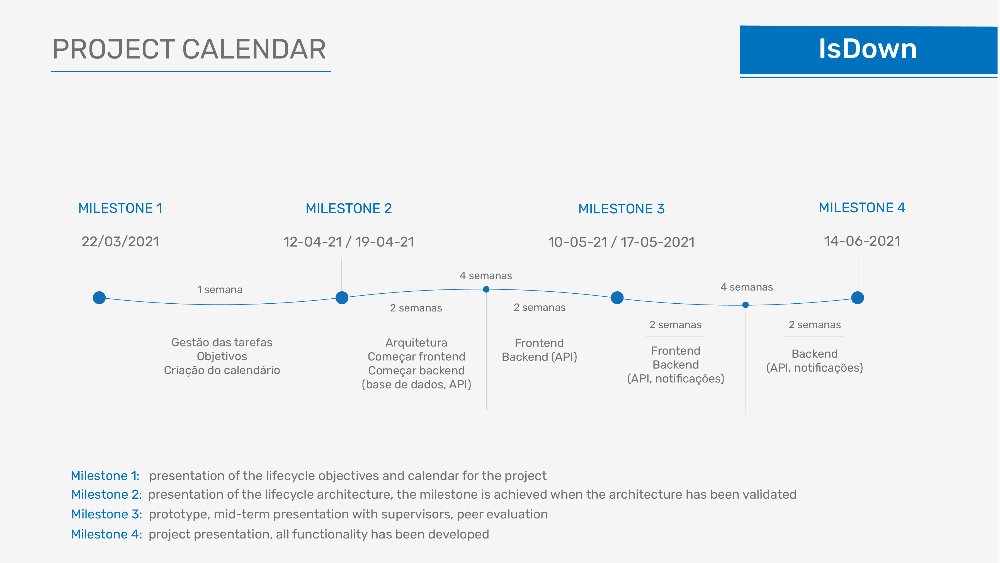

# Calendário do Projeto

## Milestone 1

**Goal:**
Presentation of the lifecycle objectives and calendar for the project.

### Sprint 1 (1 semana)

1. Gestão das Tarefas.
2. Objetivos.
3. Criação do calendário.

## Milestone 2

**Goal:**
Presentation of the lifecycle architecture; the milestone is achieved when the architecture has been validated.

### Sprint 2 (2 semanas)

1. Arquitetura.
2. Frontend #1
3. Base de Dados #1.
4. API #1.

### Sprint 3 (2 semanas)

1. Frontend #2
2. API #2

## Milestone 3

**Goal:**
Prototype; mid-term presentation with supervisors; peer evaluation.

### Sprint 4 (2 semanas)

1. Frontend #3
2. API #3
3. Notificações #1

### Sprint 5 (2 semanas)

1. API #4
2. Notificações #5

## Milestone 4

**Goal:**
Project presentation; all functionality has been developed.